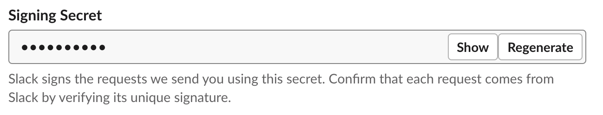

# How to Deploy the JumpCloud App for Slack with AWS

The JumpCloud App for Slack can be deployed with the click of a button, and a few additional clicks in Slack.

## Instructions

The following steps should be followed to deploy the JumpCloud Azure Slackbot to your AWS and Slack tenants.
### Create the Slack App

Creating a new Slack App is relatively simple. Refer to [Slack's documentation](https://api.slack.com/apps) as necessary. Create a net new Slack App in your Slack workspace before continuing to the next step.

### Configure Slack Permissions

Once you have created your app, click "OAuth and Permissions". Scroll down to "Scopes". Add the following OAuth scopes to your Slack Application.

Once that is done, install your Slack Application in your Workspace. This will generate a Bot OAuth token, which will be used when configuring your Serverless App in AWS.

### Configure AWS Parameters

From Slack, you'll need your App's signing secret and the Bot OAuth Token. Copy and paste this value into Azure before building the resource

The JumpCloud API Key, Organization Id (Optional), Slack Signing Secret and Slack OAuth Token parameters are all validated for correct parameter field length before the resource can be built.

Fill in these values and acknowledge that the app will create custom IAM roles and resource policies. Click "Deploy"

### Configure Slack

After the resources are built, the function url will have to be copied to your Slack App's slash command "Request URL" field to link the Slash Command to the resources in Azure.

Navigate to the newly created CloudFormation Stack. Click on the "Resources" tab and open the "SlackAppAPI".

In the sidebar, click on "Stages", then expand the "Live" stage and click on the nested "POST". This will provide you with the Invoke URL for your Application. Enter this in your Slash Command's Request URL.

### Test the App

After configuring the slack app, try to run one of the commands in your Slack Channel, your command will be processed and returned via AWS resources.
