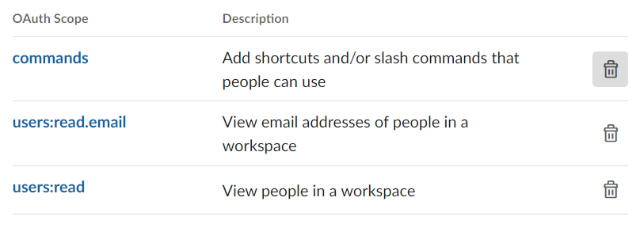
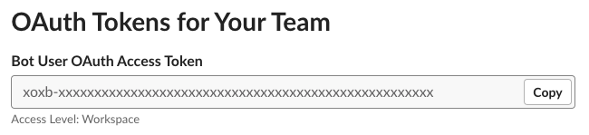
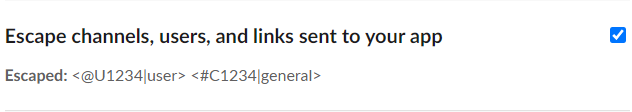
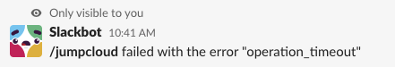
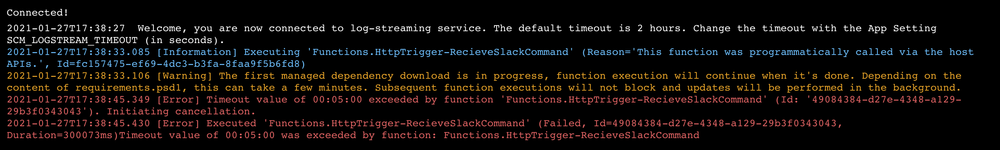
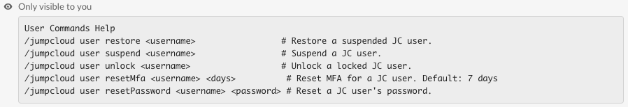

# How to Deploy the JumpCloud App for Slack in Azure

The JumpCloud App for Slack can be deployed to Azure with the click of a button, and a few additional clicks in Slack.

## Requirements

The following resources are required in both Slack and Azure to build the JumpCloud App for Slack.

Azure:

* New (or existing resource group)
* Storage account
* Application Insights
* Function App
* Key vault

App Service plan
Slack:

* New slack App
* Signing Secret
* New Slash Command

## Instructions

The following steps should be followed to deploy the JumpCloud App for Slack to your Azure and Slack resources.

### Create the Slack App

Creating a new Slack App is relatively simple. Refer to [Slack's documentation](https://api.slack.com/apps) as necessary. Create a net new Slack App in your Slack workspace before continuing to the next step.

### Configure Slack Permissions

Once you have created your app, click "OAuth and Permissions". Scroll down to "Scopes". Add the following OAuth scopes to your Slack Application.

Once that is done, install your Slack Application in your Workspace. This will generate a Bot OAuth token, which will be used when configuring the JumpCloud App for Slack in Azure.

### Configure Azure Parameters

Click the "Deploy to Azure" button to open the deployment template in your Azure tenant.

After clicking the "Deploy to Azure" button and logging in to your Azure tenant, fill out the required parameters to build the JumpCloud App for Slack in your Azure tenant.

From Slack, you'll need your App's signing secret. Copy and paste this value into Azure before building the resource

The JumpCloud API Key, ORG Id and slack Signing Secret parameters are all validated for correct parameter field length before the resource can be built. Optionally, change the data storage retention value for extended logging (There may be additional costs associated with changing this value).

Click "Review + Create" and wait for the resources to complete deployment.

### Configure Slack

After the resources are built, the function url will have to be copied to your Slack App's slash command "Request URL" field to link the Slash Command to the resources in Azure.

In Azure, Navigate to the newly created function app, click the functions item in the left navigation column and select the "HttpTrigger-ReceiveSlackCommand" function. Click Get Function URL and copy the url

Paste this URL into the Slack App Slash Command "Request URL Field"

Before saving, check the "Escape channels, users, and links sent to your app" box. Click "Save". This will allow you to use slack `@username` within the JumpCloud App for Slack command syntax.

### Initialize the App

After configuring the slack app, jump back to the Slack Channel where the App was configured and send the app a command:

`/slashCommandName user help`

The initialization of the JumpCloud App for Slack may take some time to download the required PowerShell modules, by default Slack must receive a url response in three seconds it will return an timeout error if it does not. While Azure Initializes the JumpCloud App for Slack, you may see a response on your slack channel stating that your slack command failed. This is expected until the App initializes.

If watching the HttpTrigger function logs, the console may return a message similar to the following until the function and it's PowerShell modules are initialized. Until the managed dependencies are finished downloading, the App will queue commands triggered through the Slack channel.

After the function has initialized, the Slack Channel should populate your JumpCloud App for Slack commands.

